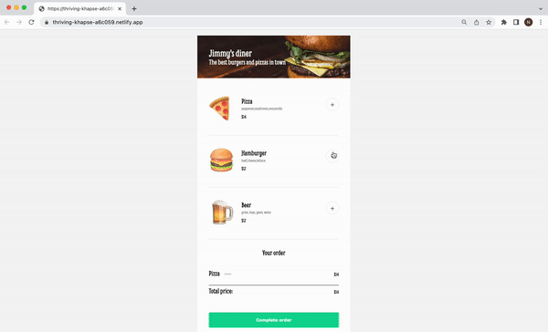

# Restaurant ordering app

Food delivery app

## Features
When a user clicks on a plus button, a new section appears that contains the items that they want to order with their prices and the total price. There is an option to remove each particular item from the order. Whey they click on the Complete order button, they are presented with the payment modal. They are required to enter their name, bank card and CVV. When the user completes the form and clicks Pay, a personalized thank you message appears and they can place a new order.

## Demo

Test it on Netlify: https://restaurant-order-natalia-davtyan.netlify.app/

## Technologies
The project is built using:
* HTML
* CSS
* JavaScript

## Technical details
* Used the data file to render the items in the menu in JavaScript.
* Connected each add and remove buttons to their items.
* Different parts of the app appear and disappear after certain actions.
* Followed the design file on Figma.

## Project status
The project is complete.

## Acknowledgements
Restaurant ordering app is a solo project that was part of [the Frontend Developer Career Path at Scrimba](https://scrimba.com/learn/frontend).

## Contact
Created by [Natalia Davtyan](https://github.com/nataliadavtyan)
